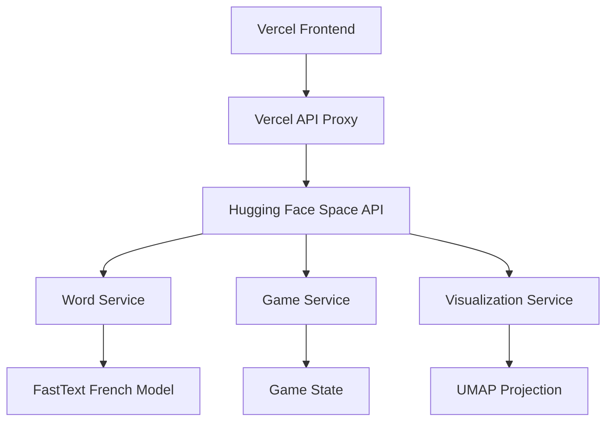
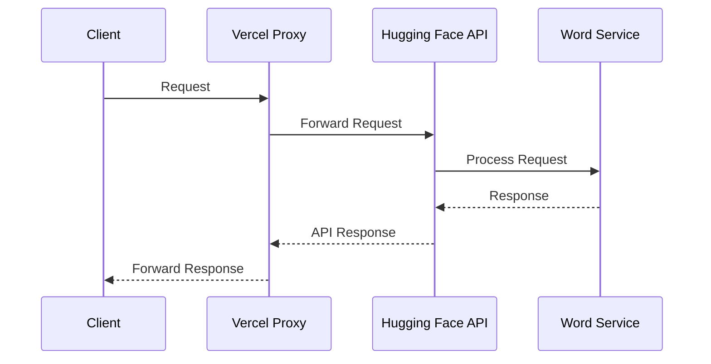

# WordVerse - Semantic Word Game Documentation

## Overview

**WordVerse** is a semantic word game where players guess words that are **semantically related** to a **hidden target word**. The game leverages **pre-trained French word embeddings (FastText)** to calculate word similarities and provides an **interactive 3D visualization** to display the relationships between words. 

### Features:
- **Semantic Word Matching:** Players enter words, and the game computes their similarity to the target.
- **Joker System:** Hints provide words within specific similarity ranges to guide players.
- **3D Visualization:** A **UMAP-powered** scatter plot helps players visualize word relationships.
- **Leaderboard & Stats:** Tracks best attempts, top similarities, and word discovery history.
- **Multiple Difficulty Levels:** Adjusts similarity thresholds and hint availability.

---

## System Architecture

### Components



### Infrastructure

- **Frontend**: Hosted on Vercel
- **API Proxy**: Lightweight Flask app on Vercel
- **Model Service**: FastAPI app on Hugging Face Spaces
- **Word Embeddings**: FastText model hosted on Hugging Face

### Data Flow



---

## Services

### **WordEmbeddingService**
- Manages **FastText-based** word embeddings for semantic similarity
- Uses singleton pattern for efficient model loading
- Handles temporary file management for model downloads
- Provides word similarity and vector operations

```python
class WordEmbeddingService:
    - calculate_similarity(word1: str, word2: str) -> float
    - get_vector(word: str) -> np.ndarray
    - get_most_similar_words(target_word: str, n: int = 100) -> List[Dict[str, float]]
    - get_words_in_range(target_word: str, min_similarity: float, max_similarity: float, n: int) -> List[Dict[str, float]]
```

### **GameService**
- Manages game state and logic
- Tracks attempts and scores
- Handles joker system
- Maintains game history

### **VisualizationService**
- Creates 3D visualization of word relationships
- Uses UMAP for dimensionality reduction
- Provides similarity-based color coding
- Handles visualization edge cases

---

## API Endpoints

| Endpoint           | Method | Description |
|--------------------|--------|-------------|
| `/api/game-state` | `GET`  | Get current game state |
| `/api/check-word` | `POST` | Check word similarity |
| `/api/visualization` | `GET`  | Get 3D visualization data |
| `/api/reset-game` | `POST` | Reset game with new word |
| `/api/use-joker` | `POST` | Use joker to get hints |
| `/api/health` | `GET` | Service health check |
| `/api/get-center-word` | `POST` | Get semantically central word |

---

## Game Configuration

```python
GAME_CONFIG = {
    "difficulty": {
        "easy": { "jokers_high_similarity": 3, "words_per_joker": 5 },
        "medium": { "jokers_high_similarity": 2, "words_per_joker": 3 },
        "hard": { "jokers_high_similarity": 1, "words_per_joker": 2 }
    },
    "jokers": {
        "similarity_ranges": {
            "high": {"min": 0.7, "max": 0.8},
            "medium": {"min": 0.6, "max": 0.7}
        }
    }
}
```

---

## File Structure
```
wordverse/
├── README.md
├── vercel.json
├── backend/
│   ├── app.py           # Lightweight proxy
│   └── requirements.txt # Minimal requirements
├── frontend/
│   ├── public/
│   ├── src/
│   │   ├── main.ts
│   │   ├── types.ts
│   │   ├── services/
│   │   │   └── api.ts
│   │   └── utils/
│   │       ├── visualization.ts
│   │       ├── word-list-updates.ts
│   │       └── ui-updates.ts
│   ├── package.json
│   └── tsconfig.json
└── model-service/       # Hugging Face Space
    ├── app.py          # FastAPI application
    ├── requirements.txt
    ├── Dockerfile
    ├── services/
    │   ├── game_service.py
    │   ├── visualization_service.py
    │   └── word_service.py
    └── config/
        └── game_config.py
```

---

## Deployment

### Vercel Deployment
- Frontend static files
- Lightweight Flask proxy
- Environment variables:
  - `MODEL_API_URL`: Points to Hugging Face Space

### Hugging Face Space
- FastAPI model service
- Full game logic and ML components
- Environment variables:
  - `MODEL_URL`: FastText model location

---

## **Next Steps**
- **Add leaderboard tracking**
- **Improve feedback on low-similarity guesses**
- **Implement multiplayer mode**
- **Add caching layer for model responses**
- **Implement rate limiting**

🎯 **WordVerse is now ready for deep semantic exploration!** 🚀