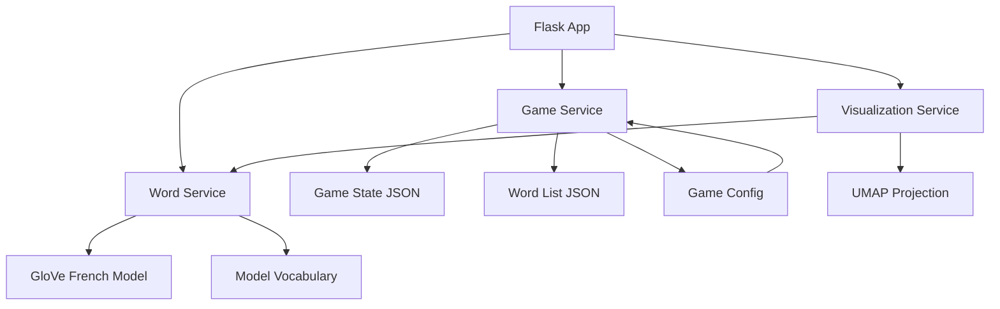
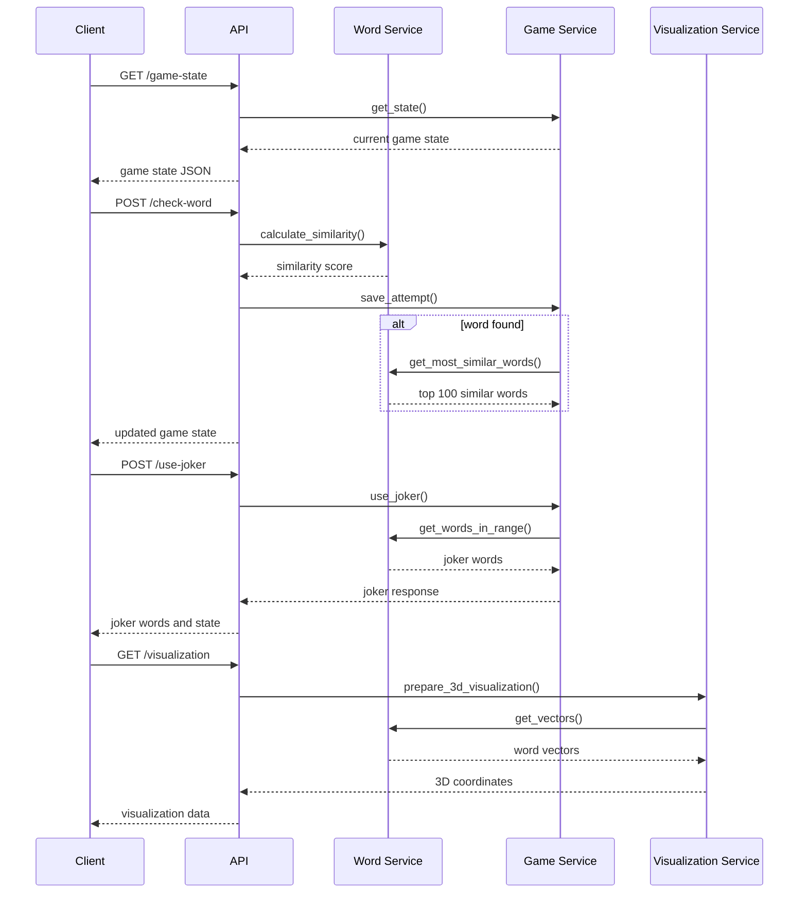
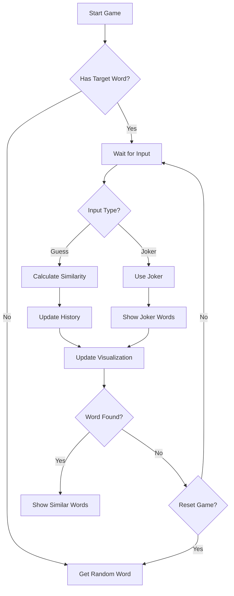

# WordVerse - Semantic Word Game Documentation

## Overview

**WordVerse** is a semantic word game where players guess words that are **semantically related** to a **hidden target word**. The game leverages **pre-trained French word embeddings (GloVe)** to calculate word similarities and provides an **interactive 3D visualization** to display the relationships between words. 

### Features:
- **Semantic Word Matching:** Players enter words, and the game computes their similarity to the target.
- **Joker System:** Hints provide words within specific similarity ranges to guide players.
- **3D Visualization:** A **UMAP-powered** scatter plot helps players visualize word relationships.
- **Leaderboard & Stats:** Tracks best attempts, top similarities, and word discovery history.
- **Multiple Difficulty Levels:** Adjusts similarity thresholds and hint availability.

---

## Backend Architecture

### Components



### Data Flow



---

## Services

### **WordEmbeddingService**
- Manages **GloVe-based** word embeddings for semantic similarity.
- Computes **cosine similarity** between words.
- Generates **concept vectors** using vector arithmetic (e.g., `"roi" - "homme" + "femme" = "reine"`).
- Finds **most similar words** in the vocabulary.
- Provides words **within specific similarity ranges** for joker hints.

```python
class WordEmbeddingService:
    - calculate_similarity(word1: str, word2: str) -> float
    - get_vector(word: str) -> np.ndarray
    - get_most_similar_words(target_word: str, n: int = 100) -> List[Dict[str, float]]
    - get_words_in_range(target_word: str, min_similarity: float, max_similarity: float, n: int) -> List[Dict[str, float]]
    - create_concept_vector(positive_words: list, negative_words: list) -> np.ndarray
```

### **GameService**
- **Manages the game state** (target word, attempts, hints used).
- Tracks word guesses and **updates history**.
- Allows **game resets** to start a new round.
- Integrates with **WordEmbeddingService** for similarity checks.

```python
class GameService:
    - get_state() -> dict
    - save_attempt(word: str, similarity: float) -> dict
    - reset_game() -> dict
    - get_history() -> List[Dict]
    - use_joker(joker_type: str) -> Dict
```

### **VisualizationService**
- **Projects words into 3D space** using **UMAP**.
- **Re-centers the target word** at the origin (`0,0,0`).
- Handles **edge cases**, ensuring fallback visualizations if UMAP fails.
- Provides **color-coding** based on similarity.

```python
class VisualizationService:
    - prepare_3d_visualization(target_word: str, guessed_words: list) -> list
```

---

## API Endpoints

| Endpoint           | Method | Description |
|--------------------|--------|-------------|
| `/api/game-state` | `GET`  | Get current game state |
| `/api/check-word` | `POST` | Check word similarity |
| `/api/visualization` | `GET`  | Get 3D visualization data |
| `/api/reset-game` | `POST` | Reset game with new word |
| `/api/use-joker` | `POST` | Use joker to get hints |

---

## Game Configuration

```python
GAME_CONFIG = {
    "difficulty": {
        "easy": { "jokers_high_similarity": 3, "words_per_joker": 5 },
        "medium": { "jokers_high_similarity": 2, "words_per_joker": 3 },
        "hard": { "jokers_high_similarity": 1, "words_per_joker": 2 }
    },
    "jokers": {
        "similarity_ranges": {
            "high": {"min": 0.7, "max": 0.8},
            "medium": {"min": 0.6, "max": 0.7}
        }
    }
}
```

---

## **Visualization Improvements**
- **UMAP improvements**:
  - Now dynamically **adjusts `n_neighbors`** to prevent errors when few words are present.
  - Falls back to **randomized clustering** when fewer than 5 words are available.
- **Color-coding for words** based on similarity.
- **Plotly.js frontend improvements**:
  - Interactive zoom & rotation.
  - **Fixed target placement at (0,0,0)**.
  - **Dark mode support**.

---

## **Game Logic & Flow**



---

## **File Structure**
```
project/
├── backend/
│   ├── app.py
│   ├── routes.py
│   ├── config/
│   │   └── game_config.py
│   ├── data/
│   │   ├── game_state.json
│   │   └── word_list.json
│   └── services/
│       ├── game_service.py
│       ├── visualization_service.py
│       └── word_service.py
└── frontend/
    ├── index.html
    ├── package.json
    ├── tsconfig.json
    └── src/
        ├── main.ts
        ├── types.ts
        ├── services/api.ts
        └── utils/
            ├── visualization.ts
            ├── word-list-updates.ts
            ├── ui-updates.ts
```

---

## **Key Updates**
✅ **UMAP issues fixed**: Now gracefully handles small data sets.  
✅ **GloVe embeddings fully integrated** (no more word2vec conversions).  
✅ **Concept vectors added**: Custom embeddings for abstract ideas.  
✅ **Plotly frontend improvements**: **Smooth colors, better responsiveness**.  

---

## **Next Steps**
- **Add leaderboard tracking**.
- **Improve feedback on low-similarity guesses**.
- **Implement multiplayer mode**.

🎯 **WordVerse is now ready for deep semantic exploration!** 🚀